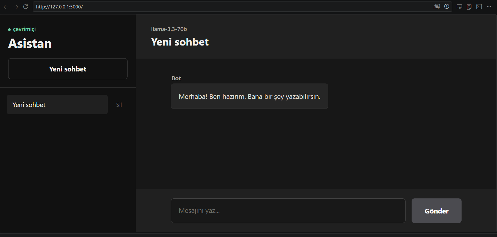

# Chatbot Project

This project is a modern AI chatbot application built with Flask. Users can create conversations, view chat history, and interact with an LLM model powered by the Groq API.

## Screenshot



## Features

- Modern chatbot interface
- Conversation history system
- Create new conversations
- Delete conversations
- Store chat history in a JSON file
- Flask backend architecture
- Groq API integration
- AI assistant with natural responses

## Technologies Used

- Python
- Flask
- HTML
- CSS
- JavaScript
- Groq API
- python-dotenv
- httpx

## Project Structure

```text
chatbot/
|-- app.py                     -> Starts the Flask application
|-- backend/
|   |-- config.py              -> Stores constant settings
|   |-- routes.py              -> Page and API routes
|   |-- services/
|   |   |-- chat_service.py    -> Conversation logic
|   |   `-- chatbot.py         -> AI/Groq operations
|   `-- storage/
|       `-- json_storage.py    -> File reading and saving
|-- templates/                 -> HTML files
|-- static/                    -> CSS and JavaScript files
|-- images/                    -> Images
|-- chat_history.json          -> Conversation history
|-- requirements.txt           -> Required Python packages
`-- README.md                  -> Project documentation
```

## Installation

```bash
git clone <repo-link>
cd chatbot
pip install -r requirements.txt
```

Create a `.env` file:

```env
GROQ_API_KEY=your_api_key
```

You can use `.env.example` as a template. Do not write your real API key in `.env.example`.

## Run the Project

```bash
python app.py
```

After starting the application, open:

```text
http://127.0.0.1:5000
```

Debug mode is disabled by default. To enable it during development:

```powershell
$env:FLASK_DEBUG="1"
python app.py
```

## Model Used

```text
llama-3.3-70b-versatile
```

## Architecture

The user sends a message from the web interface. The Flask backend receives the message, sends it to the Groq API, gets the LLM response, saves the conversation history, and returns the response to the frontend.

```text
User -> Frontend -> Flask Backend -> Groq API -> LLM -> Response
```

## API Endpoints

```http
GET /api/conversations
POST /api/conversations
GET /api/conversations/<conversation_id>
DELETE /api/conversations/<conversation_id>
POST /api/chat
POST /reset
```

## Limitations

- The model is not trained from scratch.
- A ready-made LLM API is used.
- Conversation history is stored in a JSON file.
- There is no user authentication system.

## Purpose

This project was developed to understand the working principles of Large Language Models (LLMs) and transformer-based chatbot systems. It also provides practical experience with Flask backend development, API integration, and chatbot application architecture.
